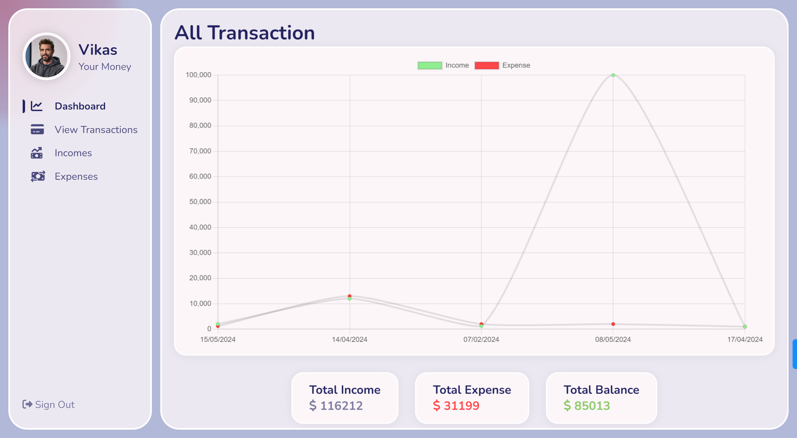

# Expense Tracker Application

Welcome to the Expense Tracker Application! This application allows you to keep track of your incomes and expenses efficiently. Below is a detailed description of the features and functionalities of the application.



## Features

- **Dashboard:** 
  - Displays total income, total expenses, and total balance.
  - Graphical representation of incomes and expenses over time.
  - Recent transaction history.
  - Minimum and maximum values for both incomes and expenses.

- **Incomes:**
  - Add new income entries.
  - Delete existing income entries.
  - Real-time updates on the dashboard when incomes are added or deleted.
  - Category selection for each income entry.

- **Expenses:**
  - Add new expense entries.
  - Delete existing expense entries.
  - Real-time updates on the dashboard when expenses are added or deleted.
  - Category selection for each expense entry.

- **Validation:**
  - Ensures all required fields are filled before adding an entry.

- **Dynamic UI:**
  - Real-time updates of data in the graphical representation and transaction history.
  - Customizable background with floating animations using custom hooks.

## Getting Started

### Prerequisites

Ensure you have the following installed:
- Node.js
- npm (Node package manager)

## 🛠 Built With

### Tech Stack

#### Client
- React
- Redux
- Bootstrap
- axios
- react-router-dom
- redux-thunk

#### Server
- Node.js
- Express
- JWT
- bcrypt
- multer
- dotenv

#### Database
- MongoDB

## Key Features
- Full featured expense tracking
- Income and expense management
- Graphical representation of incomes and expenses
- Recent transaction history
- Minimum and maximum values for both incomes and expenses
- Real-time updates on data changes
- Validations for required fields
- Customizable background with floating animations

### Prerequisites

In order to run this project you need:
- Node.js
- npm
- MongoDB

### Setup

Clone this repository to your desired folder:
  
  ```sh
    git clone https://github.com/Chandan-devs-tech/expense-tracker-app.git
  ```

Navigate to the project folder:
  
  ```sh
    cd urban-seller
  ```

Install the project dependencies:
  
  ```sh
    npm install
  ```

Create a `.env` file in the root directory and add the following environment variables:
  
  ```sh
    NODE_ENV = development
    PORT = 5000
    MONGO_URI = your_mongodb_uri
    JWT_SECRET = 'your_secret'
    PAYPAL_CLIENT_ID = your_paypal_client_id
  ```

Run the project:
  
  ```sh
    npm run dev
  ```